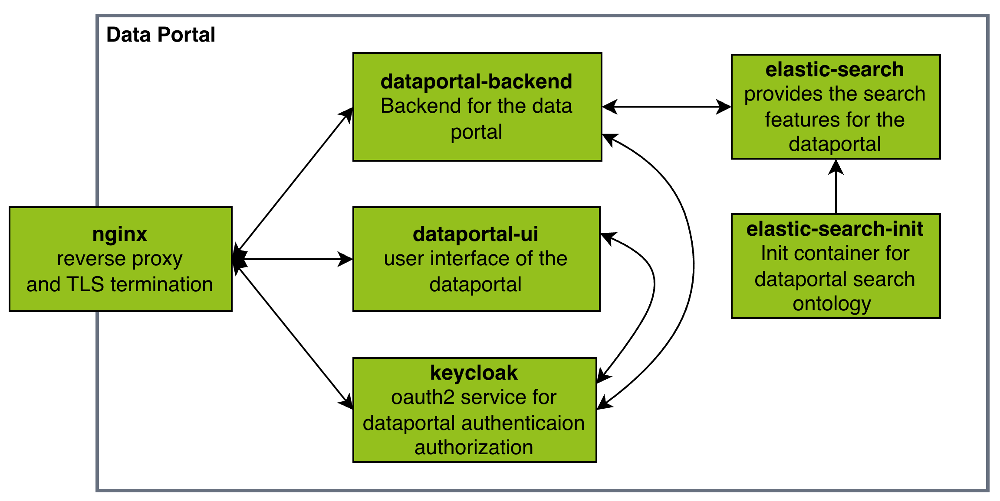

# Overview

## Purpose

The Data Portal Backend is the server-side component of the [Data Portal UI](https://github.com/medizininformatik-initiative/dataportal-ui).
It implements the backend APIs and services that power the frontend GUI for querying and exploring medical research data in a standardized, secure way. Specifically, it:

- Provides REST APIs for interacting with the Data Portal functionality (as documented in its OpenAPI specs). 
- Handles query execution, translation and integration with distributed data sources and brokers (e.g., for federated research queries). 
- Enforces access control, privacy limits, result obfuscation, and user management to ensure secure and compliant access to clinical research data. 

## Data Portal Architecture

